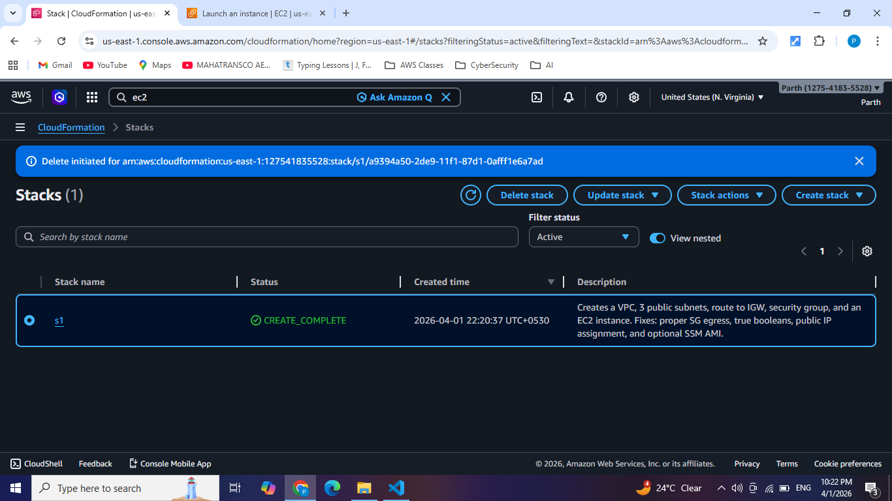
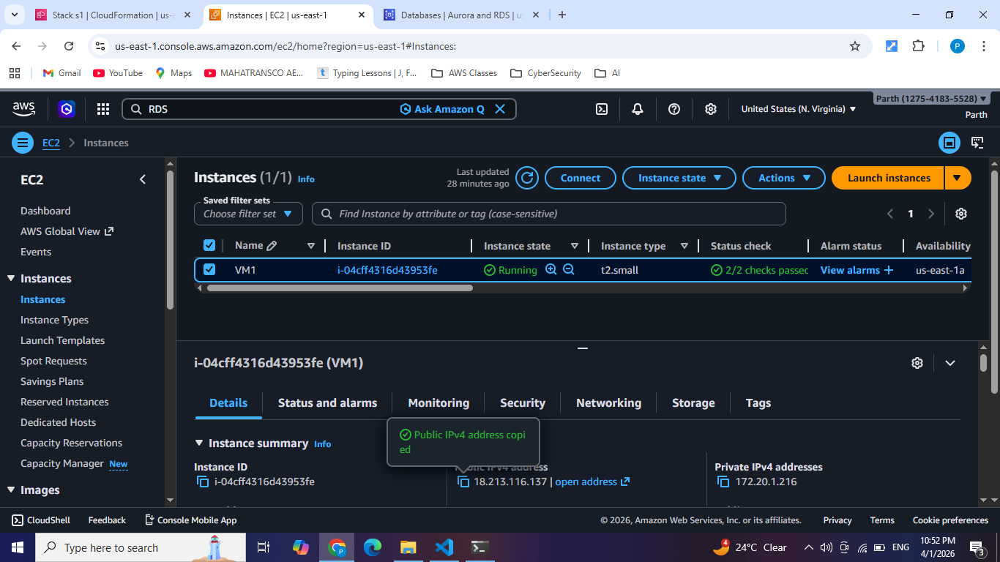
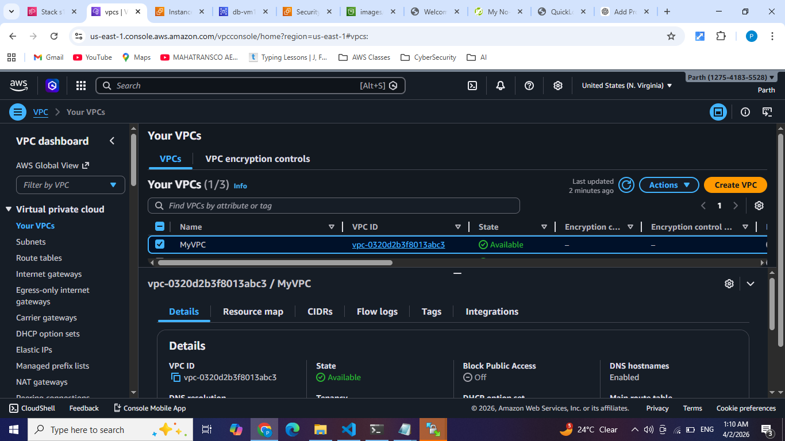
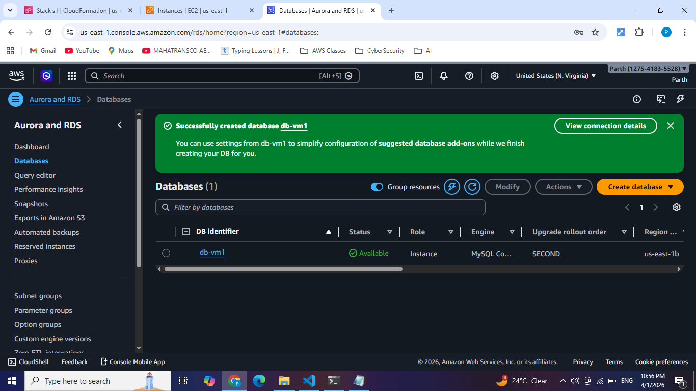
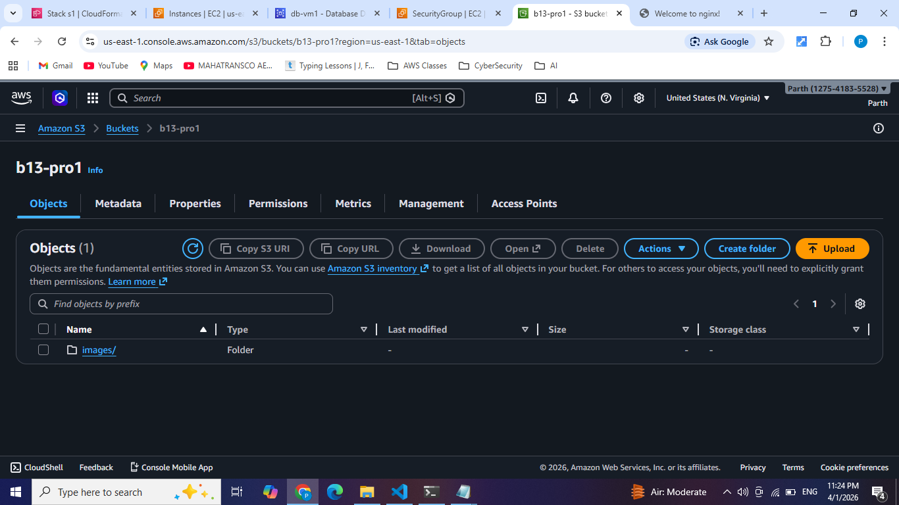
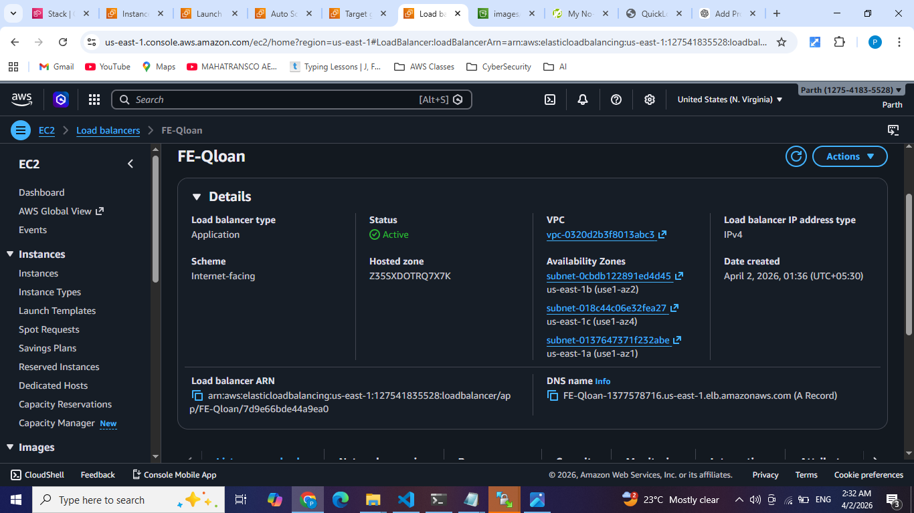
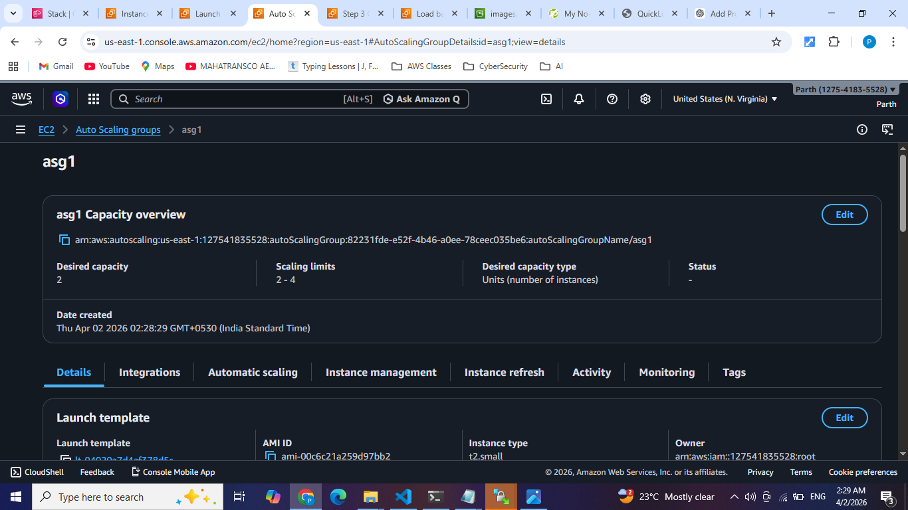
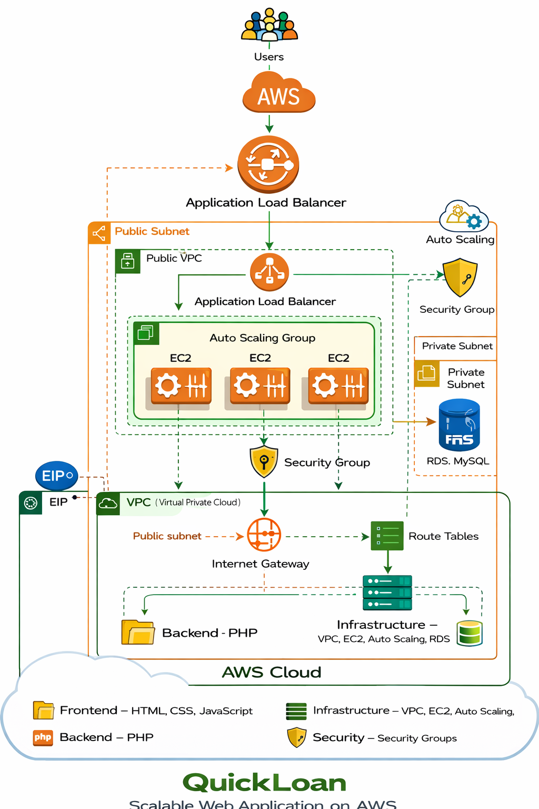

#   QuickLoan – Scalable Web Application on AWS

##   Project Overview

QuickLoan is a cloud-based scalable web application designed and deployed on AWS. The project demonstrates real-world AWS cloud architecture practices, including high availability, scalability, and secure networking.

---

##   Architecture Summary

* Designed a custom Virtual Private Cloud (VPC)
* Deployed application on EC2 instances
* Used Amazon RDS (MySQL) for database
* Implemented Auto Scaling for dynamic scaling
* Configured Application Load Balancer (ALB) for traffic distribution

---

##   Tech Stack

**Frontend:**

* HTML
* CSS
* JavaScript

**Backend:**

* PHP

**Cloud & DevOps:**

* AWS EC2
* AWS VPC
* AWS RDS (MySQL)
* AWS cloudformation
* Auto Scaling Group
* Application Load Balancer (ALB)
* AMI (Amazon Machine Image)

---

##   Implementation Steps

### 1. VPC Setup

* Created custom VPC with public and private subnets
* Configured Internet Gateway for public access
* Setup route tables

### 2. EC2 Deployment

* Launched EC2 instance
* Installed Nginx & PHP
* Deployed application code
* Tested application successfully

### 3. AMI Creation

* Created AMI from configured EC2 instance
* Used AMI for scalable deployments

### 4. Database Setup (RDS)

* Created MySQL RDS instance
* Configured Security Groups for secure access from EC2

### 5. Auto Scaling

* Created Launch Template using AMI
* Configured Auto Scaling Group
* Enabled scaling based on demand

### 6. Load Balancer

* Configured Application Load Balancer (ALB)
* Distributed traffic across EC2 instances

---

##   Security

* Implemented Security Groups for EC2 and RDS
* Restricted database access (only from EC2)
* Used private subnets for database layer

---

##  Key Features

* High Availability
* Auto Scaling (Cost Efficient)
* Load Balanced Traffic
* Secure Architecture
* Scalable Infrastructure

---

##  Project Structure

```
project/
 ├── public/
 ├── includes/
 ├── nginx/
 ├── vpc-ec2.yaml
 ├── init.sql
 ├── images/
 └── README.md
```

---

<<<<<<< HEAD
##   Screenshots (Add Here)
=======
##  Screenshots (Add Here)

* CloudFormation setup

>>>>>>> 085e9ba ( screenshots and architecture diagram)

* EC2 Instance Running


* VPC setup


* RDS Configuration


* S3 setup


* Load Balancer


* Auto Scaling Group


* Application Output


##   Architecture Diagram



---

##   Learning Outcomes

* Hands-on experience with AWS cloud services
* Real-world DevOps architecture design
* Infrastructure automation concepts
* High availability system design

---

##   Author

**Parth Kedar**
AWS Cloud & DevOps Enthusiast
